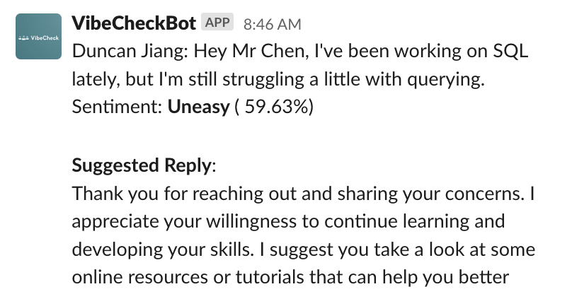

# VibeCheck

## Inspiration
Do you feel that your managers sometimes just don't get you?

As a team of 3 student interns, we have personally experienced many instances of our text messages getting lost in translation when conversing with our colleagues. Unfortunately, we are not alone. In a 2021 study conducted with over 2,000 office workers, [over 70% experienced some form of unclear communication](https://hbr.org/2021/05/did-you-get-my-slack-email-text) from their colleagues. Due to the lack of experience in navigating the workplace environment, a disproportionately high number of interns suffer from this inability to communicate effectively, with [60% of employers](https://www.digett.com/insights/what-every-intern-should-know-about-business-communication) saying that applicants lack communication and interpersonal skills.

As the world shifts towards remote work, this issue has been further exacerbated. To combat this problem, we have developed VibeCheck, a Slack bot that enables mentors to better understand how their interns are feeling and provides suggested prompts to help interns through their trying periods, especially the initial onboarding process.

Check out our demo video [here](https://youtu.be/VK1LYrRQ8Ss)! :)

## What it does
VibeCheck has 3 core features:
1. Perform sentiment analysis to better understand how the interns are feeling

2. Give recommendations on how to respond in the scenario where mentees seem to be expressing negative sentiments
3. Provide an analysis of results to the mentor at the end of each week

## How we built it
We used Hugging Face's transformers to perform sentiment analysis on the messages from mentees, allowing mentors to better understand the emotional and mental state of mentees at a quick glance. 
We chose Flask as our backend as most of the installed libraries were designed for easy integration with Python.
We chose MongoDB as our no-SQL database, given it's reliable and offers a large variety of integrations

## Challenges we ran into
We initially wanted to integrate with Microsoft Teams until we realized just how unfamiliar and time-consuming the process would be. Additionally, we experienced tremendous difficulty finding the appropriate AI models to use as this was our first time working on Natural Language Processing (NLP) and sentiment analysis.

## Accomplishments that we're proud of

1. Leveraged several AI algorithms to conduct sentiment analysis and recommend ways to help an intern through tough times
2. Successfully created a functioning Slack Bot using their documentation, capable of fulfilling the features we had set out to create.
3. Generated recommendations using conversational AI on the best responses for any given prompt. 

## What we learned

1. The sheer potential of transformers
2. Digital solutions can be used as tools to encourage better work culture

## What's next for VibeCheck (Future Work)

We intend to move onto removing the friction of coordinating meetings in a natural and seamless way to improve asynchronous work styles championed by hybrid/remote work. 

Future development for our bot includes:
1. **Weekly prompts** asking interns how they are feeling for the week
2. **“Thumbs Up” or “Thumbs Down”** feedback system to the suggested prompts provided
3. An AI model capable with "text-to-sql" capabilities to enable the mentor to extract deeper insights from the data collected
4. A greater diversity of visualising data collected, including the use of bar and pie charts